# FORO-HUB

## Descripción

Este proyecto es un Foro sobre distintas materias tales como CALCULO, DESARROLLO, GESTION, DATABASES,
y MATEMATICA. En la cual el usario puede exponer diferentes temas y/o dudas relacionados con dichas materias.

El sistema:
- El usuario podrá crear los temas con su correspondiente descripción ya sea una duda, comentario, etc.
- Toda vez creados los temas estos podrán ser actualizados con los correspondientes comentarios.
- Así mismo los temas podrán ser Eliminados de la plataforma, sin embargo estos no serán eliminados de la Base de Datos.
- El sistema cuenta con un sistema de seguridad de Autenticación para los usuarios, con lo cual no será posible el acceso para un usuario no autorizado.

## Tecnologías Utilizadas

- Mac Os 
- Intellij IDEA ver. 2024.1.1 
- JDK de Java 21.0.2 
- Servidor Xampp Apache 
- Base de Datos MySql 
- Spring Boot 
- Spring Security
- Insomnia 
- Swagger 
- Json Web Token 

    #### Notas:
    La API realiza la autenticación de los usuarios a través de las tecnologías de Spring Security, así como Json Web Token .
    El usuario podrá probar la API REST FORO-HUB a través de la interfaz de usuario que proporciona Swagger.
    En este documento se muestra mas adelante su funcionalidad utilizando la herramienta de Insomnia.
    El usuario podrá crear, mostrar, actualizar, modificar y borrar Temas relacionados con diferentes Materias y/o cursos ya mencionados anteriormente.
    La información de dichos temas son almacenados en una Base de Datos SQL.
    La API corre de manera Local, así como la Base de Datos.
    La API muestra una lista de los temas existentes en formato Json.
    

## Demostración del Sistema

Crea Tema.
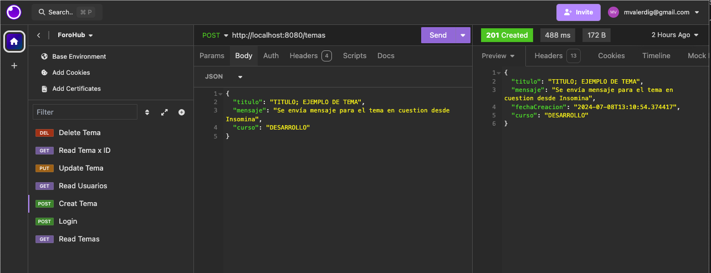

Muestra Temas.
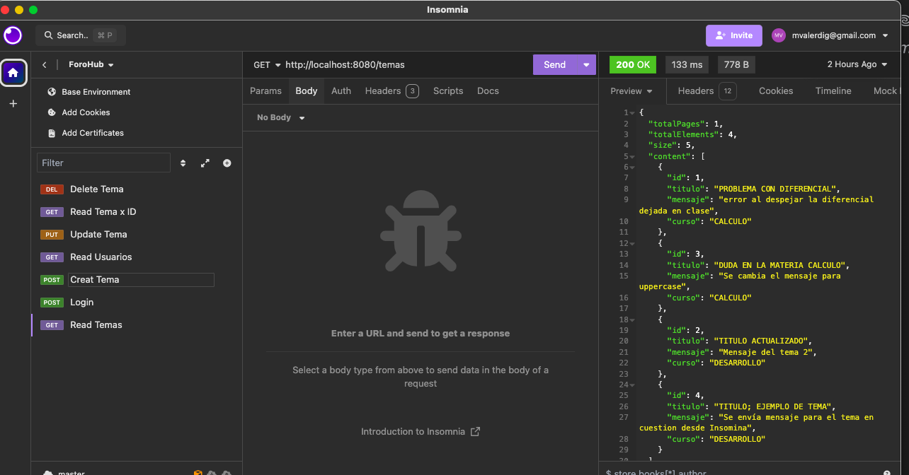

Muestra Temas por ID.
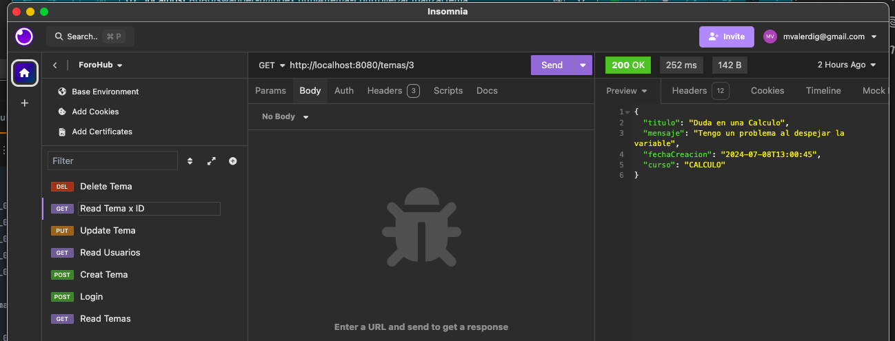

Actualiza Tema.
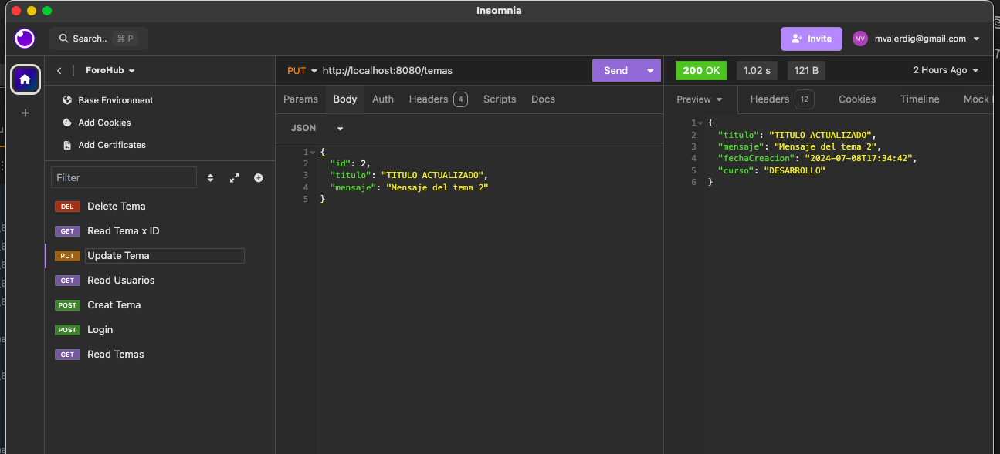

Borra Tema.
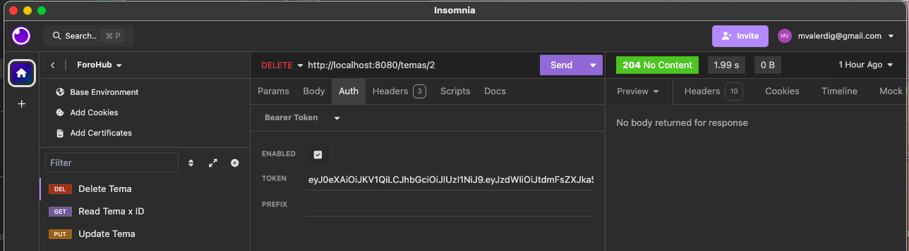

Login de Usuario.
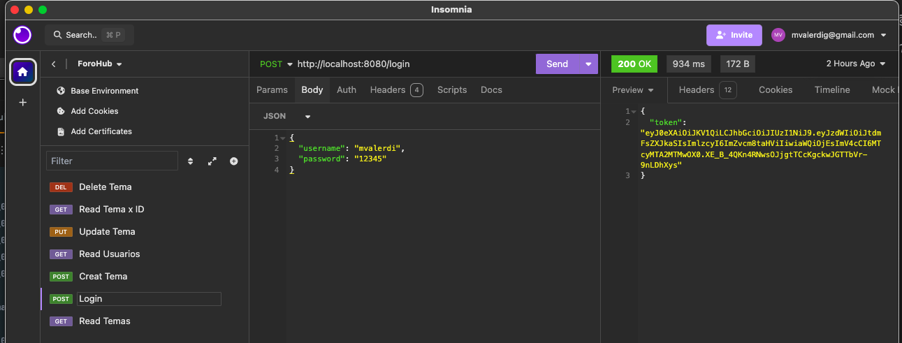

Index.
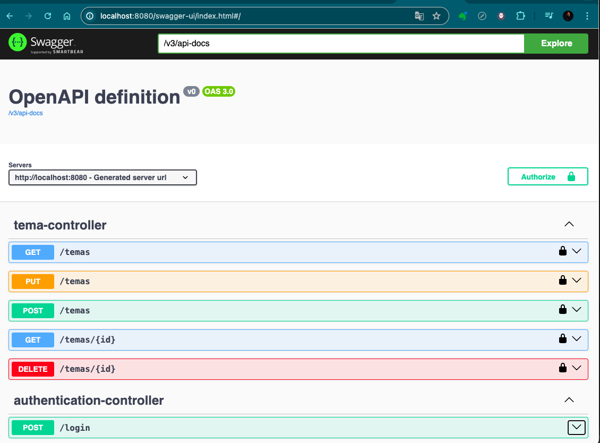

Post.
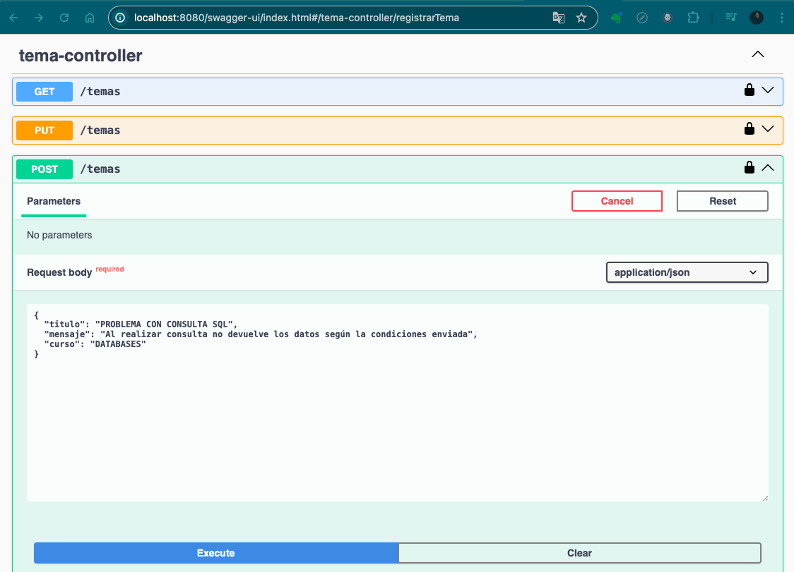

Post2.
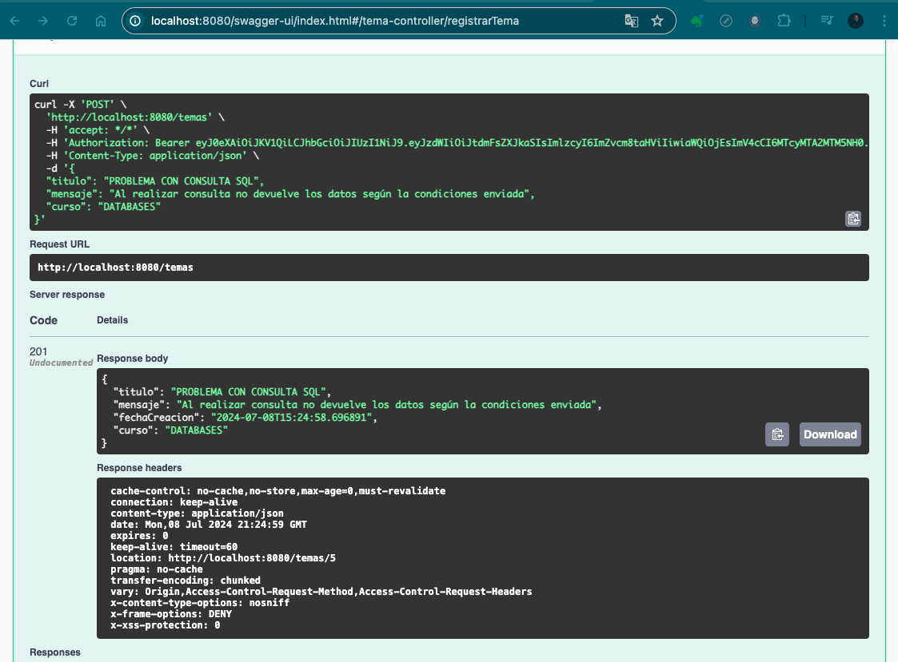

Get.
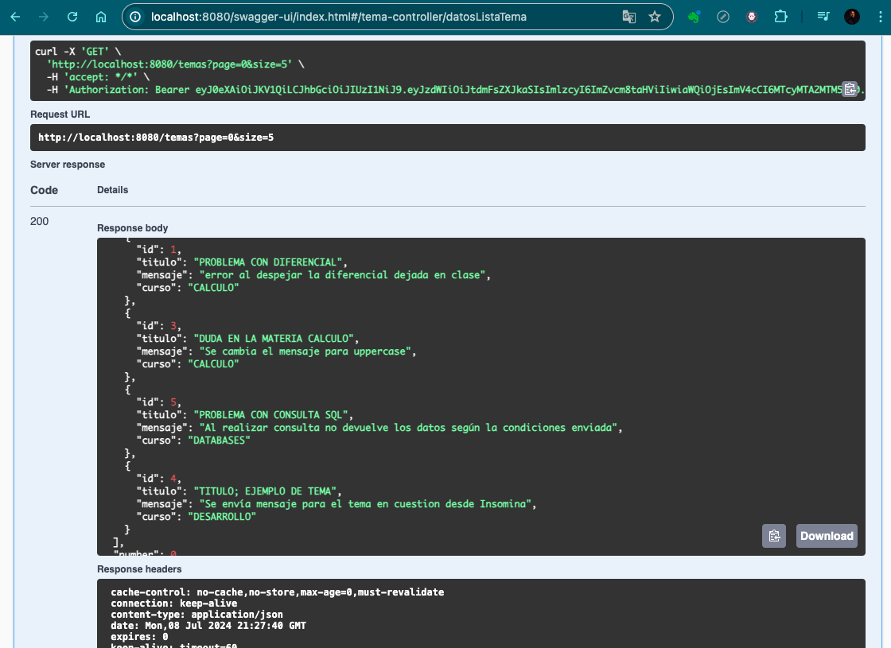

Base de Datos MySql.
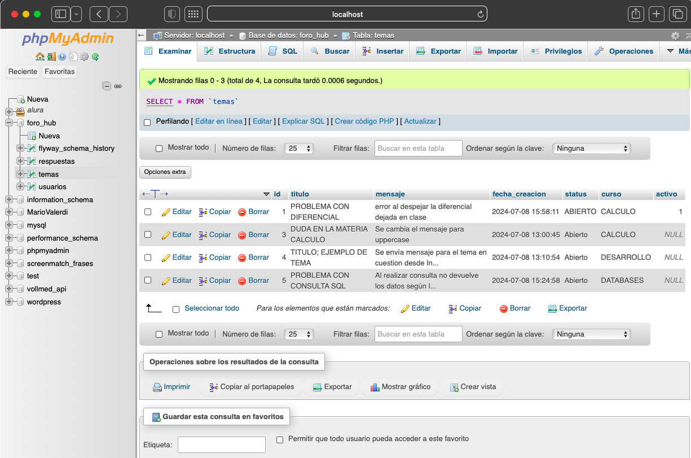

## Estado del Proyecto

El proyecto se encuentra en su versión 1.0.0.

## Acceso al Proyecto

Puedes acceder al proyecto y obtener el código fuente desde su repositorio en [GitHub Foro-Hub](https://github.com/MAValerdi/Foro-Hub).

## Instrucciones de Uso

1. Clona el repositorio desde GitHub.
2. Asegurate que el proyecto este en alguna ubicación en tu equipo local.
3. Importa el proyecto desde tu IDE Intellij IDEA o el IDE de tu preferencia.
4. Ejecuta la aplicación y sigue las instrucciones en pantalla.
5. Deberás instalar el servidor XAMPP.
6. Crear la base de datos en MySql desde phpMyAdmin de XAMPP.
7. Veriricar y en su caso agregar las dependencias de MySql y Web en el archivo pom.xml.
8. Asegurate de instalar las dependencias adiconales de Spring Security, Auth0, Flywaydb y Lombok.
9. Para el testeo de la API se puede utlizar la interfaz grafica de Swagger así como la API de Insomnia. 

## Autor
Mario Alberto Valerdi Garduño
[Linkedin Mario Valerdi](https://www.linkedin.com/in/mariovalerdi).

#### Anotaciones finales:
Challenge "FORO-HUB".
Del curso Java con Spring Boot, Spring Security, JWT.
proyecto final de ALURA Latam, Oracle ONE G6
